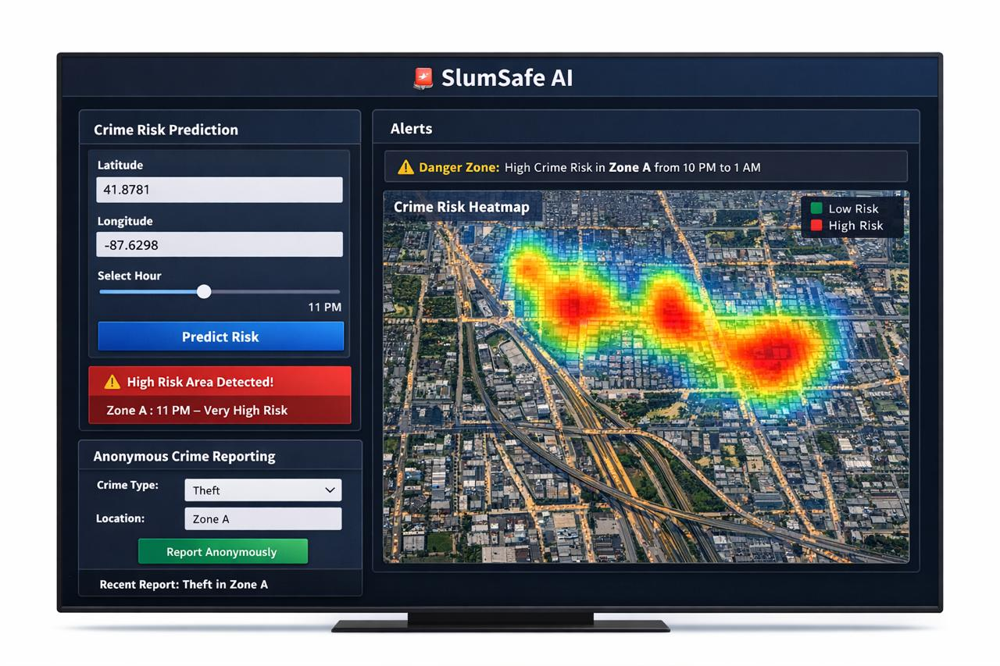

# 🚨 SlumSafe AI

### Making Invisible Crime Visible & Predictable

<p align="center">
  
  
  
  
  
</p>

<p align="center">
  <b>Transforming data-dark zones into actionable intelligence using AI</b>
</p>

---

## 📌 Problem Statement

Urban slums experience disproportionately high crime rates, yet a large portion of these incidents go **unreported** due to:

* Fear of retaliation
* Lack of anonymity
* Limited access to reporting systems
* Low digital literacy

This leads to **data invisibility**, where entire communities are excluded from official datasets.

> ❌ No data → ❌ No visibility → ❌ No intervention

---

## 🔍 Detailed Problem Insight

Urban slums often function as **data-dark zones**, where crime exists but is not reflected in structured systems.

This creates critical challenges:

* 📉 Authorities rely on incomplete or biased data
* 🚫 Preventive measures are rarely implemented
* ⚠️ Crime patterns remain invisible

> **The real problem is not just crime — it is the absence of reliable data.**

---

## 💡 Solution Overview

**SlumSafe AI** is a **predictive and participatory crime intelligence system** that:

* 🧠 Predicts crime risk using AI
* 🗺️ Visualizes hotspots via heatmaps
* 📢 Enables anonymous reporting
* 🚨 Provides emergency action support

> 🔥 We don’t just analyze crime — we create visibility where none exists

---

## 💡 Detailed Solution Approach

### 🧠 1. Predictive Intelligence

* Machine learning model (Random Forest)
* Uses time and location patterns
* Estimates crime risk even with limited data

---

### 📊 2. Visual Intelligence

* Interactive heatmap using Folium
* Converts predictions into intuitive insights
* Seamless "Quick Jump" navigation across global hotspots (Mumbai, Bangalore, Goa)

---

### 📢 3. Participatory Data Generation

* Instant **1-Tap** Anonymous reporting system (No typing required)
* Encourages community contribution
* Reduces underreporting

---

### 🔁 4. Continuous Learning Loop

```text
Limited Data → Prediction → User Reports → More Data → Better Predictions
```

---

### 🚨 5. Action-Oriented Design

* Real-time alerts
* Emergency contact feature

---

## 🖥️ UI Preview
*This UI is a conceptual design created by our team to visualize the system before implementation. It reflects our planned workflow and user experience for the final product.*
<p align="center">
  
</p>

---

## ⚙️ Features

### 🧠 Crime Risk Prediction

* Inputs: Latitude, Longitude, Time
* Output: Risk Level (Low / Medium / High)

---

### 🗺️ Heatmap Visualization

* Color-coded risk zones

  * 🔴 High
  * 🟡 Medium
  * 🟢 Low

---

### 📢 Anonymous Reporting

* Instant **1-Tap interface** for reporting incidents dynamically
* Automatically captures and maps location/timestamp directly to heatmap
* Stores data locally (CSV)

---

### 🚨 Emergency Feature

* One-click emergency call
* Uses device dialer (`tel:` link)

---

### 🔔 Alert System

* Highlights high-risk areas
* Time-based warnings

---

## 🔁 How It Works

```text
User Input (Location + Time) 
        ↓
Data Processing
        ↓
ML Model Prediction
        ↓
Risk Classification
        ↓
Heatmap Visualization + Alerts
        ↓
1-Tap Anonymous Reporting
        ↓
Continuous Improvement
```

---

## 🏗️ Tech Stack

| Layer         | Technology   |
| ------------- | ------------ |
| Frontend      | Streamlit    |
| Backend       | Python       |
| ML Model      | Scikit-learn |
| Visualization | Folium       |
| Storage       | CSV          |

---

## 📂 Project Structure

```bash
slumsafe-ai/
│
├── app.py
├── requirements.txt
├── README.md
│
├── scripts/
│   ├── crime_model.py
│   ├── fetch_chicago.py
│   └── gen_india_data.py
│
├── model/
│   └── model.pkl
│
├── data/
│   ├── crime_data.csv
│   └── reports.csv
```

---

## 🚀 Getting Started

```bash
git clone https://github.com/gee-46/SlumSafe-AI.git
cd SlumSafe-AI
pip install -r requirements.txt
streamlit run app.py
```

---

## 🌍 Impact

* 🚔 Enables proactive policing
* 🏙️ Supports urban planning
* 🤝 Helps NGOs target interventions
* 👥 Empowers underserved communities

---

## ⚠️ Limitations

* Uses simulated data for prototyping
* Model accuracy improves over time

---

## 🔮 Future Scope

* Real-time data integration
* SMS-based reporting
* NGO / police API integration
* Advanced analytics

---

## 🏆 Hackathon Context


### 🏷️ Team Name

**PulseX**

---

### 👨💻 Team Members

* **Aniroshgouda Ramanagoudar** *(Team Leader)*
* **Gautam N Chipkar**
* **Shridharsingh Rajaput**
* **Basavaraj Basagaudar**

---

### 🤝 Team Roles (Hackathon Execution)

| Member                    | Responsibility                             |
| ------------------------- | ------------------------------------------ |
| Aniroshgouda Ramanagoudar | Team Lead, Coordination, Final Integration |
| Gautam N Chipkar          | AI/ML Model & Data Pipeline                |
| Shridharsingh Rajaput     | Frontend UI & Visualization                |
| Basavaraj Basagaudar      | Features, Reporting & Deployment           |

---

### 💡 Collaboration Approach

* Modular development using Git branches
* Parallel development with structured integration
* Focus on rapid prototyping and clean execution

---

> “Built with collaboration, speed, and impact in mind.” 

---

## ⭐ Support

If you found this project interesting:

⭐ Star the repo
🍴 Fork it
💡 Build on it

---

## 📢 Final Thought

> “We are not just predicting crime — we are making invisible communities visible in data systems.”
